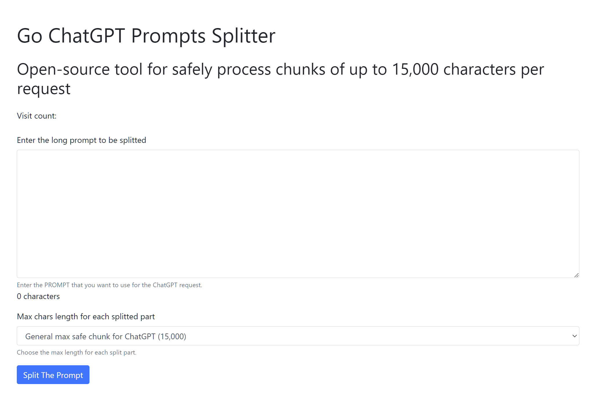

# Go ChatGPT Prompt Splitter

Introducing an interactive web application designed to optimize your use of ChatGPT - The Go ChatGPT Prompt Splitter! This dynamic tool enhances your experience with ChatGPT by allowing you to input extended prompts and conveniently split them into smaller, user-defined segments.

What sets our Prompt Splitter apart is its unique ability to integrate additional contextual prompts. This advanced feature ensures ChatGPT retains all contexts across every prompt chunk, elevating the accuracy and relevance of its responses.

Say goodbye to length limitations and context loss, and embrace an optimized, streamlined, and enriched interaction with ChatGPT using our Prompt Splitter. It's your reliable solution for managing long prompts, ensuring you get the most out of your ChatGPT conversations!

This project is a Go port from Python [ChatGPT Prompt Splitter](https://github.com/jupediaz/chatgpt-prompt-splitter) from jupediaz.

## Features
- Input text prompt and desired length to split the prompt into smaller parts.
- Display the number of site visits using a counter.
- Copy each part of the split text to the clipboard with a click of a button.

- ## Requirements
- Go 1.20 or later
- Docker and Docker Compose (only if you want to run the application with Docker)

## Installation
 
1. Clone this repository:

```bash
git clone https://github.com/yourusername/go-chatgpt-prompt-splitter.git
```

2. Change into the project directory:
 
```bash
cd go-chatgpt-prompt-splitter
```

3. Copy `.env.template` to `.env` and update the environment variables as needed:

```bash
# Port for the application to listen on
PORT=8080
```

4. Build the binary

```bash
make build
```

## Usage

### Running on Windows

If you are using Windows, you can use the provided `build.ps1` PowerShell script to build, test, lint, and run the application.

1. Open a PowerShell terminal in the project directory.

2. Run the following commands as needed:

```powershell
# To build the application:
.\build.ps1 -build

# To test the application:
.\build.ps1 -test

# To lint the application:
.\build.ps1 -lint

# To run the application:
.\build.ps1 -run
```

You can also combine these to run multiple tasks at once:

```powershell
# To build and run the application:
.\build.ps1 -build -run

# To test and lint the application:
.\build.ps1 -test -lint

# To build, test, lint, and run the application:
.\build.ps1 -build -test -lint -run
```

### Running Locally on Linux or macOS

1. Run the server (you need to have docker desktop installed, I'm planning to make it a desktop app, coming soon):
```bash
make run
```

The server will start and listen on port 8080 by default. If you want to use a
different port, you can specify the PORT environment variable in the .env file.

2. Open a web browser and navigate to http://localhost:8080 (or the port you 
specified).



3. Enter your long text in the "Prompt" textarea and specify the length of each
part in the "Split Length" field.


4. Click "Split the text" to split the prompt. The split parts will be displayed
below the form.


5. Click the "Copy to clipboard" button next to each part to copy the part to
the clipboard respectively.

### Running with Docker

1. Build and run the Docker containers:
```bash
make run-docker-build
```
This will start the Go application server in separate Docker containers.

2. Follow the same steps as above to use the application.

## Configuration
This project uses the `PORT` environment variables.

You need to specify these variables in the .env file:

```bash
# Port for the application to listen on
PORT=8080
```

Replace 8080 with the port you want the application to listen on.

## Roadmap

Our project is continuously improving and expanding! Here are some of the exciting updates and enhancements we're planning:

- [x] Remove Redis: Remove Redis from the project.
- [x] Add Docker support: Add Docker support to the project.
- [x] Add Docker Compose support: Add Docker Compose support to the project.
- [x] Add Makefile: Add Makefile to the project.
- [x] Add GitHub Actions: Add GitHub Actions to the project.
- [x] Add PowerShell script: Add PowerShell script to the project.
- [x] Add ChromePD: Add ChromePD to the project, it opens the browser and loads the page automatically.
- [ ] Add tests coverage for handlers
- [ ] Support for PDF files: Introduce ability to upload PDFs, convert to text, and split the text into manageable parts.
- [ ] Add SQLite: Add SQLite to the project to support splitted prompts and PDF files history.
- [ ] Transform the tool into a cross-platform desktop application, compatible with Windows, macOS, and various Linux distributions.
- [ ] Improve the UI with Flutter Web: Upgrade front-end to use Flutter Web for a more dynamic, responsive user interface.
- [ ] Connect to OpenAPI API, user can select and use any API from OpenAPI with either GPT-3.5 or GPT-4 and get response directly. 
- [ ] Continuous Improvements: Always open to enhancements and new feature suggestions to better serve our users.

## Contributing
Pull requests are welcome. For major changes, please open an issue first to discuss what you would like to change.

### License

[MIT](https://choosealicense.com/licenses/mit/) License
